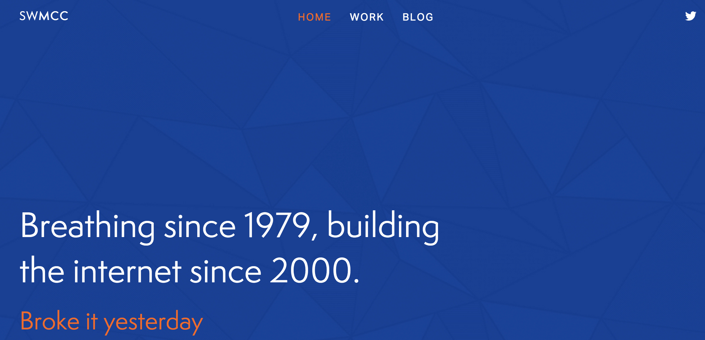

# theonlystephen 

**theonlystephen*  */ˈtheˌonlystephen/*

*Noun:*  
The personal website of Stephen McCullough

*Synonyms:*	
Stephen's site



## Description

The personal website of Stephen McCullough. Designed by [Melissa Keizer](http://melissakeizer.com/). 

This site is built using [jekyll](http://jekyllrb.com) and hosted on [Digital Ocean](http://www.digitalocean.com).

## Development Info

### Installation

Requires [bundler](http://bundler.io) and [npm/node](https://www.npmjs.com/).

```
git clone https://github.com/swmcc/swmcc.github.io.git 
cd swmcc.github.io 
make init
```

### Tests

```
make tests
```

### Running locally

Note that Compass must be running when making changes to CSS.

```
make run
```
